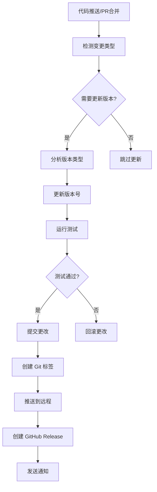

# 版本管理系统使用指南

## 📦 概述

本项目采用语义化版本控制 (Semantic Versioning) 和自动化版本管理系统，支持手动和自动两种版本更新方式。

## 🎯 版本号规则

遵循 `MAJOR.MINOR.PATCH` 格式：

- **MAJOR** (主版本号): 不兼容的 API 修改
- **MINOR** (次版本号): 向下兼容的功能性新增
- **PATCH** (修订号): 向下兼容的问题修正

### 版本更新触发条件

| 变更类型 | 版本类型 | 示例 | 说明 |
|---------|---------|------|------|
| 🚀 重大重构、破坏性变更 | MAJOR | 1.0.0 → 2.0.0 | API 不兼容变更 |
| ✨ 新功能、新模块 | MINOR | 1.0.0 → 1.1.0 | 新增功能特性 |
| 🐛 Bug 修复、性能优化 | PATCH | 1.0.0 → 1.0.1 | 问题修复 |

## 🛠️ 手动版本管理

### 基本命令

```bash
# 查看当前版本
npm run version:current

# 更新补丁版本 (1.0.0 -> 1.0.1)
npm run version:patch "修复图片复制问题"

# 更新次要版本 (1.0.0 -> 1.1.0)
npm run version:minor "新增 AI 集成功能"

# 更新主要版本 (1.0.0 -> 2.0.0)
npm run version:major "重构工具链架构"

# 设置指定版本
npm run version:set 2.1.0

# 同步版本号 (package.json 和 moon.mod.json)
npm run version:sync
```

### 高级选项

```bash
# 不创建 Git 标签
node scripts/version-manager.js patch "修复问题" --no-git

# 不更新 CHANGELOG.md
node scripts/version-manager.js minor "新功能" --no-changelog

# 组合选项
node scripts/version-manager.js major "重大更新" --no-git --no-changelog
```

## 🤖 自动版本管理

### GitHub Actions 自动触发

系统会根据以下条件自动触发版本更新：

#### 1. 提交信息关键词检测

| 关键词 | 版本类型 | 示例提交信息 |
|-------|---------|-------------|
| `breaking`, `major`, `BREAKING CHANGE` | MAJOR | `feat: 重构 API 接口 BREAKING CHANGE` |
| `feat`, `feature`, `新功能`, `新增` | MINOR | `feat: 新增 AI 智能分析功能` |
| `fix`, `bug`, `修复`, `hotfix` | PATCH | `fix: 修复图片复制失败问题` |

#### 2. 文件变更检测

| 变更路径 | 触发条件 | 版本类型 |
|---------|---------|----------|
| `moonbit/src/lib/**/*.mbt` | MoonBit 核心文件 | MINOR (最低) |
| `src/**`, `*.js` | 主要源码文件 | MINOR (最低) |
| `package.json`, `moon.mod.json` | 配置文件 | PATCH (最低) |

#### 3. 手动触发

在 GitHub Actions 页面可以手动触发版本更新：

1. 进入 `Actions` → `Auto Version Management`
2. 点击 `Run workflow`
3. 选择版本类型和描述
4. 点击 `Run workflow` 执行

### 自动化流程



## 📋 版本管理最佳实践

### 1. 提交信息规范

使用 [Conventional Commits](https://www.conventionalcommits.org/) 规范：

```bash
# 功能新增
git commit -m "feat: 新增 AI 代码优化功能"

# Bug 修复
git commit -m "fix: 修复批量处理内存泄漏问题"

# 重大变更
git commit -m "feat!: 重构工具链 API

BREAKING CHANGE: 移除了旧的编译接口"

# 文档更新
git commit -m "docs: 更新 API 使用文档"

# 性能优化
git commit -m "perf: 优化图片处理算法性能"
```

### 2. 版本发布流程

```bash
# 1. 确保代码质量
npm run ci  # 运行完整的 CI 检查

# 2. 更新版本
npm run version:minor "新增功能描述"

# 3. 验证更新
npm run version:current
git log --oneline -5

# 4. 推送到远程 (如果使用 --no-git 选项)
git push origin main
git push origin --tags
```

### 3. 版本回滚

```bash
# 回滚到指定版本
git reset --hard v1.1.0
npm run version:set 1.1.0

# 或者创建新的修复版本
npm run version:patch "回滚到稳定版本"
```

## 🔧 配置说明

### 版本管理器配置

版本管理器会自动处理以下文件：

- `package.json` - 主项目版本
- `moonbit/moon.mod.json` - MoonBit 模块版本
- `CHANGELOG.md` - 更新日志
- Git 标签 - 版本标记

### GitHub Actions 配置

在 `.github/workflows/auto-version.yml` 中可以自定义：

- 触发条件
- 版本检测规则
- 自动化流程步骤
- 通知方式

## 📊 版本历史追踪

### 查看版本历史

```bash
# 查看所有版本标签
git tag -l

# 查看版本间的差异
git diff v1.1.0..v1.2.0

# 查看特定版本的详细信息
git show v1.2.0

# 查看 CHANGELOG
cat CHANGELOG.md
```

### GitHub Release

每次版本更新都会自动创建 GitHub Release，包含：

- 📋 更新内容描述
- 🔄 变更类型说明
- 📊 项目统计信息
- 🛠️ 使用方法指南

## ❓ 常见问题

### Q: 版本号不同步怎么办？

```bash
# 使用同步命令
npm run version:sync
```

### Q: 自动版本更新失败？

1. 检查 GitHub Actions 日志
2. 确认权限设置正确
3. 手动执行版本更新
4. 检查测试是否通过

### Q: 如何跳过自动版本更新？

在提交信息中包含 `[skip version]` 或 `version`、`release`、`bump` 等关键词。

### Q: 如何自定义版本检测规则？

修改 `.github/workflows/auto-version.yml` 中的检测逻辑。

## 🚀 未来规划

- [ ] 支持预发布版本 (alpha, beta, rc)
- [ ] 集成更多 CI/CD 平台
- [ ] 添加版本依赖检查
- [ ] 支持多分支版本管理
- [ ] 集成自动化测试报告

---

*本文档随版本管理系统更新而持续完善*